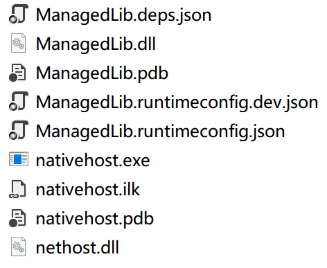

# 代码详解与运行效果

## ManagedCode

### ManagedLib

> 托管代码（C#）的类库，包含两个示例函数`float Square(float x)` 和 `LibArgs FunctionReturnStruct(LibArgs libArgs)`，其中LibArgs是自定义的结构体，用于传入与返回用户自定义的参数。
>

主要代码：[src/ManagedLib/Lib.cs](../Projects/ManagedCode/src/ManagedLib/Lib.cs)

```c#
using System;
using System.Runtime.InteropServices;

namespace ManagedLib
{
    public static class Lib
    {
        [StructLayout(LayoutKind.Sequential)]
        public struct LibArgs
        {
            public int IntNumber;
            public IntPtr Message;
            public long LongNumber;
        }

        public delegate float SquareDelegate(float x);
        public static float Square(float x)
        {
            return x * x;
        }

        public delegate LibArgs FunctionReturnStructDelegate(LibArgs libArgs);
        public static LibArgs FunctionReturnStruct(LibArgs libArgs)
        {
            LibArgs returnArgs = libArgs;
            returnArgs.IntNumber += 1;
            returnArgs.Message = Marshal.StringToHGlobalUni("Returned Message");
            returnArgs.LongNumber += 2;
            return returnArgs;
        }
    }
}

```

<br/>

### NativeHost

> Native code (C++)调用.NET主机并调用托管代码类库的函数（即ManagedLib中的两个函数）。因还未集成在UE4插件中，运行需要.NET sdk环境且适当的路径配置（与ManagedLib编译好的类库放在同一路径，详见下文BuildSolution）。

主要代码：[src/NativeHost/nativehost.cpp](../Projects/ManagedCode/src/NativeHost/nativehost.cpp)

- 初始化并载入.NET环境

```c++
	char_t host_path[MAX_PATH];
#if WINDOWS
    auto size = ::GetFullPathNameW(argv[0], sizeof(host_path) / sizeof(char_t), host_path, nullptr);
    assert(size != 0);
#else
    auto resolved = realpath(argv[0], host_path);
    assert(resolved != nullptr);
#endif

    string_t root_path = host_path;
    auto pos = root_path.find_last_of(DIR_SEPARATOR);
    assert(pos != string_t::npos);
    root_path = root_path.substr(0, pos + 1);

    //
    // STEP 1: Load HostFxr and get exported hosting functions
    //
    if (!load_hostfxr())
    {
        assert(false && "Failure: load_hostfxr()");
        return EXIT_FAILURE;
    }
```

- 初始化并启动.NET运行时

```c++
    //
    // STEP 2: Initialize and start the .NET Core runtime
    //
    const string_t config_path = root_path + STR("ManagedLib.runtimeconfig.json");
    load_assembly_and_get_function_pointer_fn load_assembly_and_get_function_pointer = nullptr;
    load_assembly_and_get_function_pointer = get_dotnet_load_assembly(config_path.c_str());
    assert(load_assembly_and_get_function_pointer != nullptr && "Failure: get_dotnet_load_assembly()");
```

- 加载托管代码（ManagedLib）并获取两个函数的函数指针。

```c++
    //
    // STEP 3: Load managed assembly and get function pointer to a managed method
    //
    const string_t managedlib_path = root_path + STR("ManagedLib.dll");
    const char_t* dotnet_type = STR("ManagedLib.Lib, ManagedLib");
    const char_t* dotnet_type_method = STR("PrintMessages");
    typedef float (CORECLR_DELEGATE_CALLTYPE* square_entry_point_fn)(float x);
    square_entry_point_fn square = nullptr;
    int rc = load_assembly_and_get_function_pointer(
        managedlib_path.c_str(),
        dotnet_type,
        STR("Square") /*method_name*/,
        STR("ManagedLib.Lib+SquareDelegate, ManagedLib") /*delegate_type_name*/,
        nullptr,
        (void**)&square);

    struct lib_args
    {
        int number;
        const char_t* message;
        int64_t number2;
    };

    typedef lib_args(CORECLR_DELEGATE_CALLTYPE* func_return_struct_entry_point_fn)(lib_args x);
    func_return_struct_entry_point_fn func_return_struct = nullptr;
    rc = load_assembly_and_get_function_pointer(
        managedlib_path.c_str(),
        dotnet_type,
        STR("FunctionReturnStruct") /*method_name*/,
        STR("ManagedLib.Lib+FunctionReturnStructDelegate, ManagedLib") /*delegate_type_name*/,
        nullptr,
        (void**)&func_return_struct);
    assert(rc == 0 && square != nullptr && "Failure: load_assembly_and_get_function_pointer()");
```

- 调用托管代码

```c++
    //
    // STEP 4: Run managed code
    //

    assert(rc == 0 && square != nullptr && "Failure: load_assembly_and_get_function_pointer()");
    std::cout << square(0.2) << std::endl;
    std::cout << square(2) << std::endl;

    lib_args args_input
    {
    0,
    STR("Sent Message"),
    0
    };
    lib_args args_output = func_return_struct(args_input);

    std::cout << args_output.number << std::endl;
    std::wcout << args_output.message << std::endl;
    std::cout << args_output.number2 << std::endl;
```

<br/>

### BuildSolution

整个托管代码的解决方案。

首先，在`ManagedCode`根目录下的`Directory.Build.props`定义了两个路径`SourceRoot` (src)和`BinRoot` (bin)。

**Directory.Build.props:**

```
<Project>
  <!-- Shared properties -->
  <PropertyGroup>
    <SourceRoot>$(MSBuildThisFileDirectory)src</SourceRoot>
    <BinRoot>$(MSBuildThisFileDirectory)bin</BinRoot>
  </PropertyGroup>
</Project>
```

主要代码：[src/BuildSolution/BuildSolution.csproj](../Projects/ManagedCode/src/BuildSolution/BuildSolution.csproj)

- 引用

```xml
<ItemGroup>
    <ProjectReference Include="$(SourceRoot)/ManagedLib/ManagedLib.csproj" />
</ItemGroup>

<ItemGroup>
    <Content Include="*.*">
        <CopyToOutputDirectory>PreserveNewest</CopyToOutputDirectory>
        <Visible>false</Visible>
    </Content>
    <Content Include="inc/*.*">
        <CopyToOutputDirectory>PreserveNewest</CopyToOutputDirectory>
        <Visible>false</Visible>
    </Content>
    <Content Include="inc.vs/*.*">
        <CopyToOutputDirectory>PreserveNewest</CopyToOutputDirectory>
        <Visible>false</Visible>
    </Content>
</ItemGroup>
```

- 主体执行代码（在各种配置与路径定义之后）

```xml
<Target Name="BuildNativeProjectWindows" AfterTargets="Build" DependsOnTargets="PrepareForNativeBuild;MSVCFindCompilerPaths" Condition="$([MSBuild]::IsOsPlatform('Windows'))">
    <PropertyGroup>
      <IncPaths>@(MSVCIncludePaths-> '/I "%(RootDir)%(Directory)%(Filename)"', ' ')</IncPaths>
      <IncPaths>$(IncPaths) /I inc /I "$(NetHostDir)"</IncPaths>
      <CompilerArgs>/EHsc /Od /GS /sdl /Zi</CompilerArgs>
      <PreprocessorDefines>/D WINDOWS</PreprocessorDefines>
      <LibPaths>@(MSVCLibPaths-> '/LIBPATH:"%(RootDir)%(Directory)%(Filename)"', ' ')</LibPaths>
      <LibPaths>$(LibPaths) "$(NetHostDir)\nethost.lib"</LibPaths>
    </PropertyGroup>

    <Exec Command="&quot;$(MSVCCompilerPath)&quot; $(SourceFiles) $(IncPaths) $(PreprocessorDefines) $(CompilerArgs) /link $(LibPaths) /out:&quot;$(NativeOutputFilePath)&quot;" WorkingDirectory="$(NativeObjDir)" ConsoleToMsBuild="true" />

    <Copy SourceFiles="$(NetHostDir)/$(NetHostName)" DestinationFolder="$(NativeBinDir)" SkipUnchangedFiles="True" />

    <Message Importance="High" Text="BuildNativeProjectWindows Finished" />

  </Target>
```

- 打印调试信息（主要是文件路径等）

```xml
<Target Name="PrintDirectories" AfterTargets="Build" DependsOnTargets="PrepareForNativeBuild;BuildNativeProjectWindows">

    <Message Importance="High" Text="Source = $(SourceRoot)" />
    <Message Importance="High" Text="Bin = $(BinRoot)" />
    <Message Importance="High" Text="NativeSource = @(NativeSource)" />
    <Message Importance="High" Text="SourceFiles = $(SourceFiles)" />
    <Message Importance="High" Text="Command_BuildNativeProjectWindows = &quot;$(MSVCCompilerPath)&quot; $(SourceFiles) $(IncPaths) $(PreprocessorDefines) $(CompilerArgs) /link $(LibPaths) /out:&quot;$(NativeOutputFilePath)&quot;" />
    <Message Importance="High" Text="IncPaths = $(IncPaths)" />
    <Message Importance="High" Text="PreprocessorDefines = $(PreprocessorDefines)" />
    <Message Importance="High" Text="CompilerArgs = $(CompilerArgs)" />
    <Message Importance="High" Text="LibPaths = $(LibPaths)" />
    <Message Importance="High" Text="WorkingDirectory = $(NativeObjDir)" />
    <Message Importance="High" Text="NetHostDir = $(NetHostDir)" />
    <Message Importance="High" Text="NetHostName = $(NetHostName)" />
    <Message Importance="High" Text="NetCoreTargetingPackRoot = $(NetCoreTargetingPackRoot)" />
    <Message Importance="High" Text="NETCoreSdkRuntimeIdentifier = $(NETCoreSdkRuntimeIdentifier)" />
    <Message Importance="High" Text="BundledNETCoreAppPackageVersion = $(BundledNETCoreAppPackageVersion)" />

  </Target>
```

<br/>

在VS中打开[BuildSolution.csproj](../Projects/ManagedCode/src/BuildSolution/BuildSolution.csproj)并添加现有项目`ManagedLib.csproj`和`NativeHost.vcxproj`，即可进行生成（需要.NET sdk环境）。生成结果默认会放置在`ManagedCode/bin/Debug`中，包含ManagedLib链接库和nativehost可执行文件：



之后，在ManagedCode根目录，命令行中执行`dotnet run`即可运行nativehost.exe并得到如下预期输出：

```
0.04
4
1
Returned Message
2
```

.NET运行配置文件 **build.proj:**

```xml
<Project Sdk="Microsoft.Build.Traversal">

  <PropertyGroup>
    <Configuration Condition=" '$(Configuration)' == '' ">Debug</Configuration>

    <RunCommand>$(BinRoot)\$(Configuration)\nativehost</RunCommand>
    <RunCommand Condition="$([MSBuild]::IsOsPlatform('Windows'))">$(BinRoot)\$(Configuration)\nativehost.exe</RunCommand>
  </PropertyGroup>

  <ItemGroup>
    <ProjectReference Include="src/NativeHost/*.csproj" />
    <ProjectReference Include="src/ManagedLib/*.csproj" />
  </ItemGroup>

</Project>
```

## UE4CLR

`Plugins/UE4CLR`是UE4插件，可以直接复制到UE4项目中使用，其中Runtime文件夹包含必须的.NET运行时（Win64 - 5.0.7）。

在[UE4CLR.Build.cs](../Projects/Plugins/UE4CLR/Source/UE4CLR)中添加对.NET运行时的依赖：

```c#
DynamicallyLoadedModuleNames.AddRange(
	new string[]
	{
		// ... add any modules that your module loads dynamically here ...
	}
	);
string NETCoreNativePath = Path.Combine(PluginDirectory, "Runtime/Win64/packs/Microsoft.NETCore.App.Host.win-x64/5.0.7/runtimes/win-x64/native");
PublicIncludePaths.Add(NETCoreNativePath);

PublicAdditionalLibraries.Add(Path.Combine(NETCoreNativePath, "nethost.lib"));

if (Target.bBuildEditor)
{
	PrivateDependencyModuleNames.AddRange(new string[] {
		"UnrealEd"
	});
}

string runtimePath = Path.Combine(PluginDirectory, "Runtime/Win64");

string[] files = Directory.GetFiles(runtimePath, "*.*", SearchOption.AllDirectories);

foreach (string file in files)
{
	RuntimeDependencies.Add(file);
}
```

[UE4CLRLibrary.h](../Projects/Plugins/UE4CLR/Source/UE4CLR/Public/UE4CLRLibrary.h)声明UE4CLR插件暴露的接口，包括初始化并运行.NET运行时的`Init()`以及对应于托管代码`ManageLib`中的两个调用函数。通过`[Module]_API`声明为dll导出类或函数。

```C++
#pragma once

#include "nethost.h"

#include "CoreMinimal.h"
#include "UE4CLRLibrary.generated.h"

UCLASS(MinimalAPI)
class UUE4CLRLibrary : public UObject
{
	GENERATED_BODY()

public:
	//Initialize and start the .NET Core runtime
	UE4CLR_API static int Init();

	//Call managed functions
	UE4CLR_API static float Square(float x = 0);
	struct lib_args
	{
		int number;
		const char_t* message;
		int64_t longnumber;
	};
	UE4CLR_API static lib_args PassAndReturnStruct(lib_args args);
};
```

其具体实现在[UE4CLRLibrary.cpp](../Projects/Plugins/UE4CLR/Source/UE4CLR/Private/UE4CLRLibrary.cpp)，与上文[NativeHost](#nativehost)中的实现基本相同。不同之处在于使用插件中附带相对路径中的.NET运行时而非在系统中寻找。此外，初始化过程只执行一次，以避免被多次调用执行。

```C++
#define LOGONSCREEN GEngine->AddOnScreenDebugMessage

...

int UUE4CLRLibrary::Init()
{
    UE_LOG(LogTemp, Warning, TEXT("In Init()"));

    if (!globals::been_loaded)
    {
        if (!load_hostfxr())
        {
            assert(false && "Failure: load_hostfxr()");
            return EXIT_FAILURE;
        }
        UE_LOG(LogTemp, Warning, TEXT("After load_hostfxr()"));

        FString config_path = FPaths::ProjectDir() + TEXT("Managed/Build/ManagedLib.runtimeconfig.json");
        UE_LOG(LogTemp, Warning, TEXT("config_path: %s"), *config_path);
        LOGONSCREEN(-1, 10.f, FColor::White, FString::Printf(TEXT("config_path: %s"), *config_path));

        globals::load_assembly_and_get_function_pointer = get_dotnet_load_assembly(*config_path);
        assert(globals::load_assembly_and_get_function_pointer != nullptr && "Failure: get_dotnet_load_assembly()");
        
        globals::lib_path = *(FPaths::ProjectDir() + TEXT("Managed/Build/ManagedLib.dll"));
        globals::been_loaded = true;
    }
    UE_LOG(LogTemp, Warning, TEXT("lib_path: %s"), globals::lib_path.c_str());
    LOGONSCREEN(-1, 10.f, FColor::White, FString::Printf(TEXT("lib_path: %s"), globals::lib_path.c_str()));
    
    return EXIT_SUCCESS;
}
```


## UE4CLR_Test

用于测试UE4CLR插件的UE4示例工程。

### 项目构建

1. 新建UE4空白项目，将UE4CLR插件`(Plugins/UE4CLR)`复制到项目根目录。重启UE4即可加载出插件。

2. 将[ManagedLib类库生成的文件](#buildsolution)复制到项目`Managed/Build`路径。

3. 编写UE4代码（[TestUE4CLR.cpp](../Projects/UE4CLR_Test/Source/UE4CLR_Test/TestUE4CLR.cpp)）调用`UUE4CLRLibrary`并测试。

   ```C++
   #define LOGONSCREEN GEngine->AddOnScreenDebugMessage
   
   ...
   
   // Called when the game starts
   void UTestUE4CLR::BeginPlay()
   {
   	Super::BeginPlay();
   
   	//Initialize and start the .NET Core runtime
   	UE_LOG(LogTemp, Warning, TEXT("Before Init()"));
   	UUE4CLRLibrary::Init();
   	UE_LOG(LogTemp, Warning, TEXT("After Init()"));
   
   	// Test calling managed functions
   	UE_LOG(LogTemp, Warning, TEXT("Calling Lib.Square(x) in ManagedLib.dll: 0.2^2 = %f"), UUE4CLRLibrary::Square(0.2));
   	LOGONSCREEN(-1, 20.f, FColor::Yellow,
   		FString::Printf(TEXT("Calling Lib.Square(x) in ManagedLib.dll: 0.2^2 = %f"), UUE4CLRLibrary::Square(0.2)));
   	UE_LOG(LogTemp, Warning, TEXT("Calling Lib.Square(x) in ManagedLib.dll: 0.4^2 = %f"), UUE4CLRLibrary::Square(0.4));
   	LOGONSCREEN(-1, 20.f, FColor::Yellow,
   		FString::Printf(TEXT("Calling Lib.Square(x) in ManagedLib.dll: 0.4^2 = %f"), UUE4CLRLibrary::Square(0.4)));
   
   	UUE4CLRLibrary::lib_args send_args
   	{
   		0,
   		L"Sent Message",
   		10
   	};
   	UUE4CLRLibrary::lib_args recv_args = UUE4CLRLibrary::PassAndReturnStruct(send_args);
   
   	FString output_msg = FString::Printf(TEXT("Calling Lib.FunctionReturnStruct(lib_args) in ManagedLib.dll: \
   		send args(0, \"Sent Message\", 10);   returned args: (%d, \"%s\", %lld)"),
   		recv_args.number, recv_args.message, recv_args.longnumber);
   
   	UE_LOG(LogTemp, Warning, TEXT("%s"), *output_msg);
   	LOGONSCREEN(-1, 20.f, FColor::Yellow, output_msg);
   	
   }
   ```

4. 其中[TestUE4CLR.h](../Projects/UE4CLR_Test/Source/UE4CLR_Test/TestUE4CLR.h)是一个Actor Component（继承自`UActorComponent`），在[Test_Level.umap](../Projects/UE4CLR_Test/Content/Test_Level.umap)中被一个empty actor使用：

   ```C++
   #pragma once
   
   #include "CoreMinimal.h"
   #include "Components/ActorComponent.h"
   #include "TestUE4CLR.generated.h"
   
   
   UCLASS( ClassGroup=(Custom), meta=(BlueprintSpawnableComponent) )
   class UE4CLR_TEST_API UTestUE4CLR : public UActorComponent
   {
   	GENERATED_BODY()
   
   public:	
   	// Sets default values for this component's properties
   	UTestUE4CLR();
   
   protected:
   	// Called when the game starts
   	virtual void BeginPlay() override;
   
   public:	
   	// Called every frame
   	virtual void TickComponent(float DeltaTime, ELevelTick TickType, FActorComponentTickFunction* ThisTickFunction) override;
   
   		
   };
   ```

5. 不要忘了在项目的`Build.cs`中添加对UE4CLR插件的依赖。

   ```c#
   PublicDependencyModuleNames.AddRange(new string[] { "UE4CLR", "Core", "CoreUObject", "Engine", "InputCore" });
   ```

6. 运行结果

   

